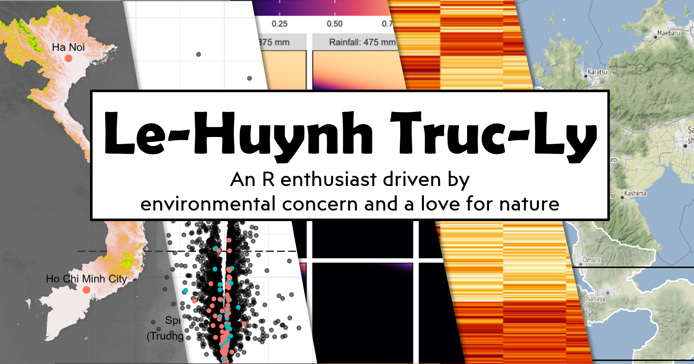

 

<!-- Social section -->

 

This is the source repository of my personal blog [lehuynh.rbind.io](https://lehuynh.rbind.io/)

The website is generated via [blogdown](https://github.com/rstudio/blogdown), 
using the [Hugo](https://gohugo.io) 
theme [Creative portfolio](https://github.com/kishaningithub/hugo-creative-portfolio-theme), 
and deployed on [Netlify](https://www.netlify.com).
