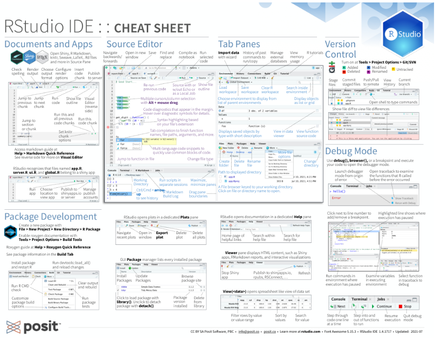
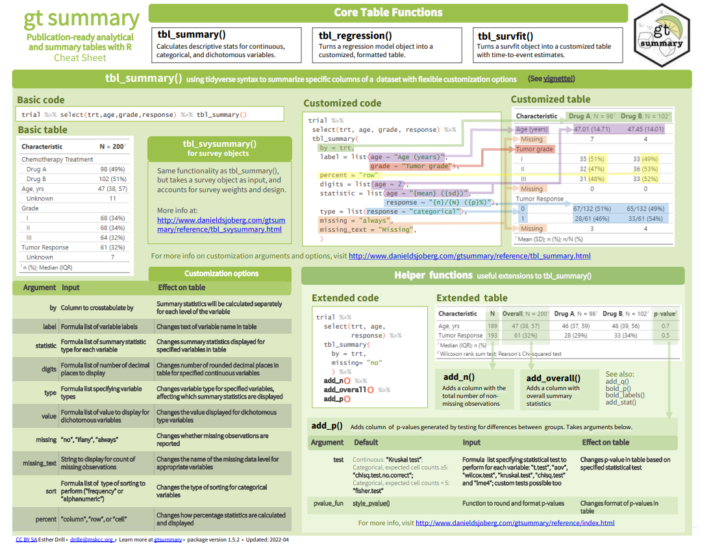
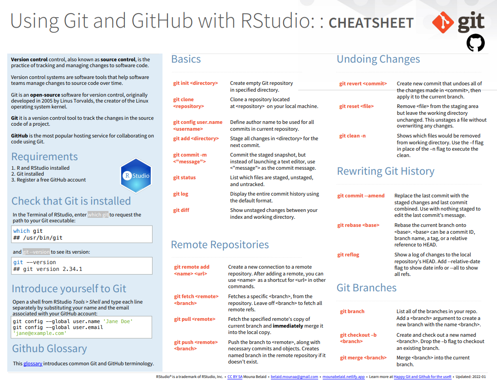

This project is driven by the belief in making technical knowledge accessible. 
The widespread use of the R programming language motivated me to bridge language barriers, fostering inclusivity in the programming community.  

While navigating the complexities of technical translation, I strive for accuracy without compromising clarity. 
Overcoming linguistic nuances, I try to make every term resonate authentically in Vietnamese, aiming to empower local programmers with easily understandable resources.  

The objective of this project exceeds mere translation; it's about cultivating a thriving community. 
I hope these translated cheatsheets can serve as a catalyst, empowering Vietnamese programmers to explore the vast landscape of R programming.  

::: {.grid}

::: {.g-col-12 .g-col-md-4 .text-center}
[{height=250px}](/top/cheatsheet_rstudio-ide_vi.pdf){target="_blank"}

RStudio IDE
:::

::: {.g-col-12 .g-col-md-4 .text-center}
[{height=250px}](/top/cheatsheet_gtsummary_vi.pdf){target="_blank"}

gtsummary
:::

::: {.g-col-12 .g-col-md-4 .text-center}
[{height=250px}](/top/cheatsheet_git-github_vi.pdf){target="_blank"}

Git & GitHub
:::

:::

