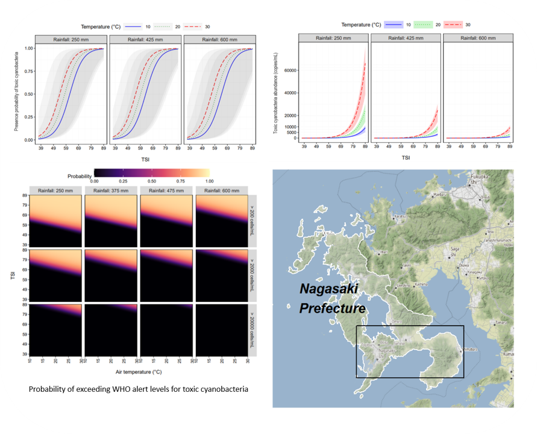

*Funded by Planetary Health Research Fellowship (Nagasaki University, Japan) and Grant-in-Aid for Scientific Research (Japan Society for the Promotion of Science)*

`2020 - 2023`

**Topics**: Bayesian statistical modelling · Harmful cyanobacteria · Zero-inflated data · Environmental science  

**My contributions**: Conceptualization · Data collection · Data curation · Data analysis · Data visualization · Cartography · Software development · Code management · Writing and editing article manuscripts  

**Skills used**: Bayesian modeling · R · JAGS · Stan · RMarkdown · LaTeX · Git · GNU Make · Parallel computing  

→ <a href="https://github.com/le-huynh/cyano_bayesian_model" target="_blank">GitHub repository</a>  
→ <a href="https://nagasaki-u.repo.nii.ac.jp/records/28153" target="_blank">Dissertation</a>  

This project aims to develop a statistical predictive model for early-warning of toxic cyanobacteria, specifically *Microcystis*. 
The proposed Bayesian hurdle Poisson model effectively addressed the zero-inflation issue in cyanobacterial data. 
This resulted in the predictions of cyanobacterial presence probability, abundance, and the probability of exceeding WHO alert levels. 
These predictions could serve as a quick reference for water management decisions, including monitoring planning and testing. 
The principal predictor variables—air temperature, rainfall, and trophic state index—can be easily and affordably obtained, offering flexibility in data acquisition. 
In the context of climate change, where harmful cyanobacterial blooms may occur earlier and longer, the model developed in this project could be a practical tool within cyanobacterial early-warning systems.  

**Reproducible research code**  

> **Le-Huynh, T.-L.**. (2023). Bayesian predictive model for toxic cyanobacteria occurrence from eutrophication and climate data (Version v1.0.0) [Computer software]. Zenodo. [https://doi.org/10.5281/zenodo.20472023](https://doi.org/10.5281/zenodo.20472023){target=_blank}

 

