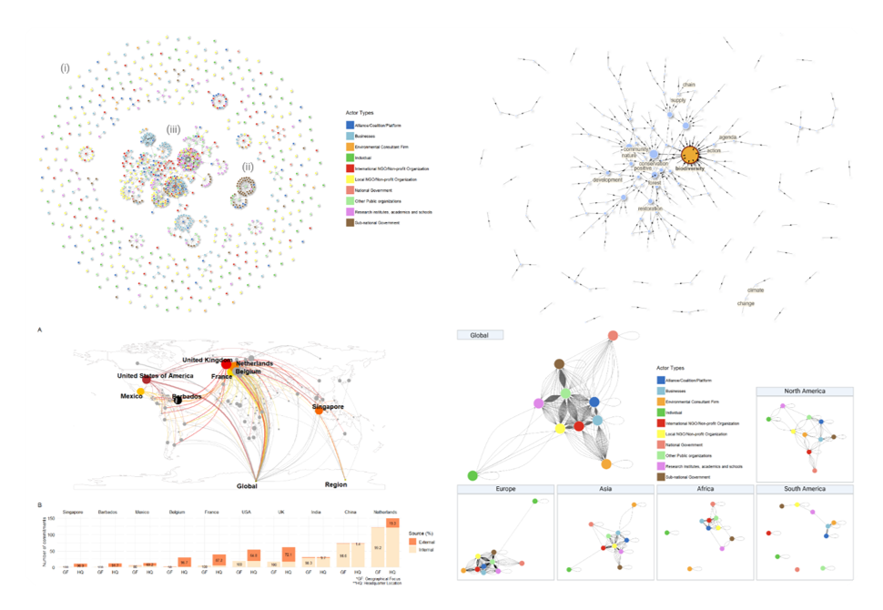

*A collaboration with Wyss Academy for Nature at University of Bern, Switzerland*

`2024 - 2025`

**Topics**: Environmental politics · Biodiversity governance  

**My contributions**: Data analysis · Data visualization · Data curation · Code management  

**Skills used**: Network analysis · Text Mining analysis · Discourse analysis · R · RMarkdown · Git · GNU Make

## Publications
> Nguyen, V. T. H., **Le‑Huynh, T.‑L.**, Gadola, S., Nguyen, Q., Walters, G., Owuor, M. A (2025). 
Local-Global Linkages in Biodiversity Governance: The Regime Complex of 
the Convention on Biological Diversity Agenda for Nature Pledges. 
*Environmental Science & Policy*, 173(November), 104246. 
[https://doi.org/10.1016/j.envsci.2025.104246](https://doi.org/10.1016/j.envsci.2025.104246){target="_blank"}

**Abstract**  
The trajectory of global biodiversity governance, culminating in the 2022 Kunming-Montreal Global Biodiversity Framework (KMGBF), reflects a pivot toward transformative change through a “whole-of-society” (WoS) approach. 
This approach integrates traditional multilateral negotiations with various self-organizing governance initiatives across the public, civil, and business spheres, forming additional layers within a biodiversity regime complex. 
While praised for its flexibility, horizontal linkages, and adaptability, an open question remains: Has this regime complex effectively delivered on its transformative promises? 
Using 718 biodiversity pledges submitted to the Action Agenda for Nature under the Convention on Biological Diversity—representing 1086 actors and 4109 connections—we applied social network and discourse analysis to map dynamic actor interactions and examine how they shape regime dynamics. 
Our findings reveal the emergence of a “middle-out” governance space, where non-state and sub-national actors act as intermediaries linking global commitments to local implementation. 
By visualizing the diffusion of participation, we identify potential leverage points where these actors can step forward as agents of change within the biodiversity regime. 
Yet despite these advances, network fragmentation persists—marked by duplication, misalignment, and weak cross-scale connectivity. 
Divergent discourses and weak ties between biodiversity status and actions further hinder systemic coherence. 
We argue that the regime complex must be reconceptualized beyond horizontal linkages to include vertical dimensions of governance. 
This study contributes to emerging network approaches in global biodiversity governance by identifying governance gaps and highlighting 
opportunities for systemic transformation. 
Strengthening alignment across levels and empowering middle-out actors are essential steps toward translating ambitious global biodiversity goals into effective, inclusive, and locally grounded actions.

## Reproducible research code

> Nguyen, V. T. H., **Le‑Huynh, T.‑L.**. (2026). Reproducible code for "Local-global linkages in biodiversity governance: The regime complex of the convention on biological diversity agenda for nature pledges" (Version v1.0.0) [Computer software]. Zenodo. [https://doi.org/10.5281/zenodo.20495877](https://doi.org/10.5281/zenodo.20495877){target=_blank}

