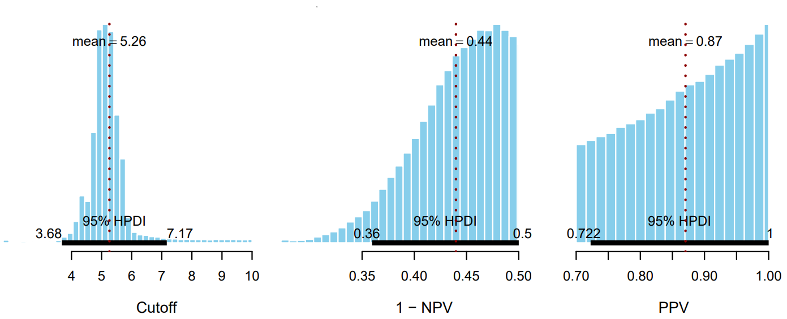

*A collaboration with Graduate School of Biomedical Sciences, Nagasaki University, Japan*

`2021 - 2022`

**Topics**: Bayesian modelling · Predictive modelling · Biomedical science · Biomarker evaluation  

**My contributions**: Data analysis · Bayesian statistical modelling · Data visualization · Writing and editing article manuscript (Bayesian-related part)  

**Skills used**: Bayesian modeling · Biostatistics · R · SAS · RMarkdown · LaTeX · Git · GNU Make

This collaborative project aims to identify a potential spectrum of biomarkers for predicting NPSLE, offering crucial clinical insights before the onset of neuropsychiatric symptoms. 
Using a novel Bayesian model, the project determined the cutoff concentration of anti-suprabasin antibodies and associated predictive values (PPV, NPV). 
The findings from this project could assist in clinical trials, aid in making decisions about patient care, guide treatment choices, and enable cost-effective interventions.  

## Publication
> Hoang, T. T. T., Ichinose, K., Morimoto, S., Furukawa, K., **Le-Huynh, T.-L.**, Kawakami, A. (2022). 
Measurement of anti‑suprabasin antibodies, multiple cytokines and chemokines as potential predictive biomarkers for neuropsychiatric systemic lupus erythematosus. *Clinical Immunology*, 237(March), 1–8. [https://doi.org/10.1016/j.clim.2022.108980](https://doi.org/10.1016/j.clim.2022.108980){target="_blank"}

**Abstract**  
Neuropsychiatric systemic lupus erythematosus (NPSLE) varies in presentation and is one of the leading causes of morbidity and mortality among patients with SLE. 
This study determined the most critical serum biomarkers for the development of NPSLE as they may have clinical utility prior to the onset of neuropsychiatric symptoms. 
We retrospectively analyzed 35 NPSLE patients, 34 SLE patients, 20 viral meningitis (VM) patients, and 16 relapsing-remitting multiple sclerosis (MS) patients. 
We measured anti-suprabasin antibodies concentrations in serum by using Luciferase immunoprecipitation system (LIPS) assay. The serum concentrations of cytokines/chemokines were measured by using multiplex bead-based assay. 
We found serum FGF-2 level was significantly higher in the NPSLE group compared to the SLE group and the healthy control group. The anti-suprabasin antibody relative concentration (SRC) has high positive predictive values for the development of NPSLE. 
The most essential biomarkers are VEGF, anti-suprabasin antibodies, sCD40L, IL-10, GRO, MDC, IL-8, IL-9, TNF-α, MIP-1α.

## Reproducible research code

> **Le-Huynh, T.-L.**. (2023). Reproducible code for "Measurement of anti-suprabasin antibodies, multiple cytokines and chemokines as potential predictive biomarkers for neuropsychiatric systemic lupus erythematosus" (Version v1.0.0) [Computer software]. GitHub. [https://github.com/le-huynh/2022_Hoang_SBSN_ClinImmunol](https://github.com/le-huynh/2022_Hoang_SBSN_ClinImmunol){target=_blank}

## Presentation

> Hoang, T. T. T., Ichinose, K., Morimoto, S., Furukawa, K., **Le-Huynh, T.-L.**, Kawakami, A., Measurement of anti-suprabasin antibodies, multiple cytokines and chemokines as potential predictive biomarkers for neuropsychiatric systemic lupus erythematosus [Poster presentation], *Annals of the Rheumatic Diseases*, 2022;81:658.

 

